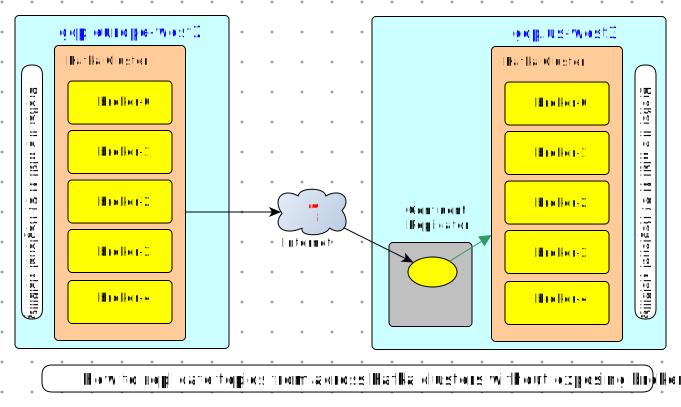

## Kakfa Cloud Replicator

Kafka clusters provide reliable event ingestion and processing within a cloud region however some applcations need to replicate Kafka topics securely and efficiently between Kafka Clusters running in different cloud regions.

## Challenges

1. _Broker visibility_ across cluster.
2. _Security requirements_

