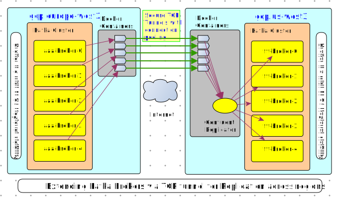
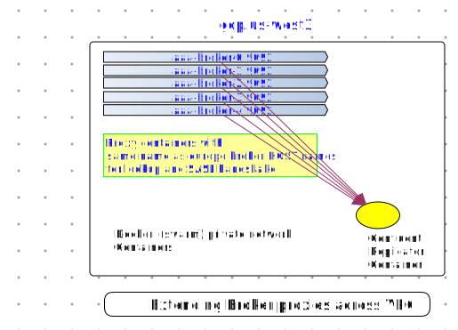

## Kakfa Cloud Replicator

Kafka clusters provide very reliable and high performant messaging backbone by means of clustered brokers, partitioned topics and replicated partitions.Kafka clusters are most efficient when all brokers reside in the same physical data center or same compute region in a cloud. However many global businesses need a messaging backbone which spans across geographic regions. A single Kafka cluster spanning over WAN is not an ideal solution. A better solution is to have a Kafka cluster in each geographic region and link those clusters via a high bandwidth replicator.


Tools such as confluent Repliator and Kafka Mirror maker can replicate topics and events across multi datacenter Kafka deployments. However there are few challenges related to secure __network connectivity__ and __broker host discovery__ which need to be addressed to enable these replicaiton solutions. This project aims to adress these challenges and provide a viable solution for creating Kafka inter cluster connection.

## Challenges

1. _Broker connectivity_ : The kafka broker hosts are typically protected by a firewall and are not exposed on the internet. The Kafka services are used from a peered local VPC. Replicator is a Kafka Client program and like a typical Kafka client it needs to be able to establish connection to all the broker servers on both the source and target clusters.
2. _Broker hostname resolution_ : SASL security imposes the requirement that the client name should be able to lookup and connect to Brokers by using their specified FQDNs which appear in the Client <-> Kafka Cluster connection handshake.

## Extending VPC via secure TCP tunnel

This project relies on secure and highly performant TCP tunnels achieved by running the gotunnel - https://github.com/xjdrew/gotunnel.git.





The setup enables a Kafka Client to securely establish TCP connections with __all__ the brokers running in remote kafka cluster and access them as if they are available locally.



## Usage

## 1. Prerequisites

* Two Running kafka cluster instances in GCP cloud. 
* VMs enabled with docker version 18 + and docker-compose version 3.0 + , running in a Peered VPC local to each of hte kafka clustes.
* VMs should have mutually resolvable public IP addresses.
* Firewall ports need to be opened on source VPC such that the destination VM can establish connections with the source VM. The ports that need to be opened are displayed on the console after running the below steps.

## 2. Preperation

> Note this step applies to both VMs

Create the project folder with a name indicating the replication direction  `~/workspace/kafka-cloud-replicator-{SRC}-{DEST}` e.g  folder name `~/workspace/kafka-cloud-replicator-eu-la`

```bash
# Create project directory
> export PROJECT_FOLDER=~/workspace/kafka-cloud-replicator-eu-la
> git clone <THIS GIT REPO> ${PROJECT_FOLDER}
> cd ${PROJECT_FOLDER}
# Create setenv.sh file here with the content from step 2
```

Create a env setup file `${PROJECT_FOLDER}/setenv.sh` from the `setenv.sh.template`.

```bash

#
# SOURCE_* represents the config setup to connect to the source side of the Repliator
#

export SOURCE_CLUSTER_ID=orange
export SOURCE_BROKER_SERVERS=pkc-orange.us-east1.gcp.confluent.cloud:9092,b0-pkc-orange.us-east1.gcp.confluent.cloud:9092,b1-pkc-orange.us-east1.gcp.confluent.cloud:9092
export SOURCE_API_KEY=srckee
export SOURCE_API_SECRET=srcscrtsrcscrt


#
# Destination_* represents the config setup to connect to the destination side of the Repliator
#

export DESTINATION_CLUSTER_ID=grape
export DESTINATION_BROKER_SERVERS=pkc-grape.us-west1.gcp.confluent.cloud:9092,b0-pkc-grape.us-west1.gcp.confluent.cloud:9092,b1-pkc-grape.us-west1.gcp.confluent.cloud:9092,b2-pkc-grape.us-west1.gcp.confluent.cloud:9092
export DESTINATION_API_KEY=dstkee
export DESTINATION_API_SECRET=dstscrtdstscrt


# e.g All  topic names  matching eu.xaz.* will be replicated
export REPLICA_TOPICS_SOURCE_REGEX=eu[.]xaz[.].*
#  e.g.   eu.xaz.customerbillstopic from source  becomes  eu.xaz.customerbillstopic.copy in target cluster
export REPLICA_TOPICS_DEST_SUFFIX=copy


export SOURCE_SIDE_TUNNEL_IP=433.34.23.45
export DESTINATION_SIDE_TUNNEL_IP=476.34.23.45
## -- Shared Secret for enabling trust between two ends of the tunnel
export SHARED_SECRET='list here have high-quality instruction and are priced appropriately'
```
> Firewall ports will need to be opened - Read the output of following commands. 

## 3-A. Setup at source VPC

Run following commands on the VM peered with the `source` Kafka Cluster

```bash
> cd ${PROJECT_FOLDER}
# edit the setenv.sh
> vi setenv.sh
# Prepare the configuration
> ./bin/prepare_src_config.sh
```

>  The output shows the Firewall ports that need to be open

Run docker containers on the source

```bash
> docker-compose up -d
```

## 3-B. Setup at destination VPC

Run following commands on the VM peered with the `destination` Kafka Cluster

```bash
# Replicate git
> cd ${PROJECT_FOLDER}
# Create setenv.sh file here with the content from step 2
> vi setenv.sh
# Prepare the configuration
> ./bin/prepare_dest_config.sh
```

> The output shows the Firewall ports that need to be open

Run docker containers on the source

```bash
 > docker-compose up -d
```

## 4. Testing

If all goes well you should be able to see the connector with name `replicator-${source_cluster_id}` in the control center

* Test for topic replication from source to target
* Test for topic partition balancing between source and target
* Test event propogation from source to target

## Troubleshooting

> docker-compose fail- ERROR: Pool overlaps with other one on this address space
```bash
# Clean networks
docker network ls -q | xargs docker network rm
# Retry
docker-compose up -d
```